# 🔨 Custom Recipes

All plugin recipes are declared in `RecipeManager.java` (`items/recipes/RecipeManager.java`) as shapeless-free `ShapedRecipe`s using exact item choices, so components crafted elsewhere in the chain are required as-is (same NBT tag).

Grids below use 3×3 crafting rows; `.` means **empty slot**.

*All recipe photos are in `images/recipes/` — each shows the in-game crafting UI.*

---

## 🏗️ Intermediate components

### Star Core
**Result:** `§e§lStar Core` (NETHER_STAR) — the heart of a fallen star.

```
N B N
B S B
N B N
```

- `N` = NETHERITE_BLOCK
- `B` = DIAMOND_BLOCK
- `S` = NETHER_STAR


### Sword Mold
**Result:** `§f§lSword Mold` (IRON_HORSE_ARMOR) — base shape for bladed weapons.

```
I A I
A I A
I A I
```

- `I` = IRON_INGOT
- `A` = IRON_BLOCK

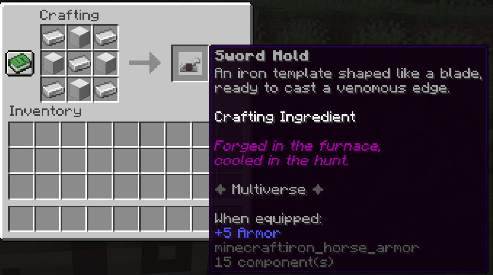

### Reinforced Bone Block
**Result:** `§f§lReinforced Bone Block` (BONE_BLOCK) — 9× Reinforced Bone.

```
R R R
R R R
R R R
```

- `R` = Reinforced Bone (exact)


### Ender Core
**Result:** `§3§lEnder Core` (SHULKER_SHELL) — intermediate for ender-tier weapons.

```
D F D
F N F
D F D
```

- `D` = DIAMOND
- `F` = Ender Fragment (exact)
- `N` = NETHER_STAR

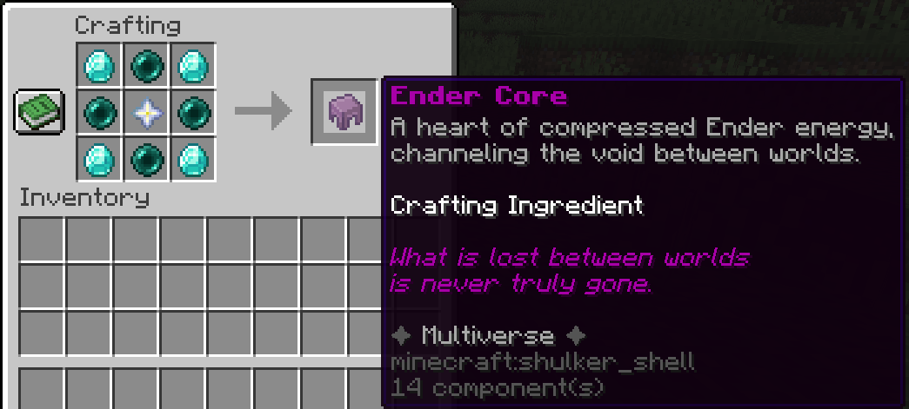

### Chaos compression chain
Chaos Orb is used as the "glue" for each step:

**Chaos Powder** — `§4§lChaos Powder` (ECHO_SHARD):
```
. G .
G O G
. G .
```

- `G` = GLOWSTONE_DUST, `O` = Chaos Orb (exact)

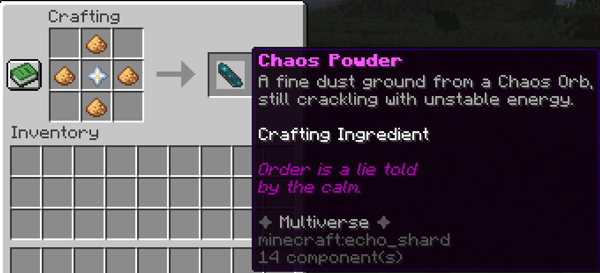

**Chaos Fragment** — `§4§lChaos Fragment` (AMETHYST_SHARD):
```
P P P
P O P
P P P
```

- `P` = Chaos Powder (exact), `O` = Chaos Orb (exact)

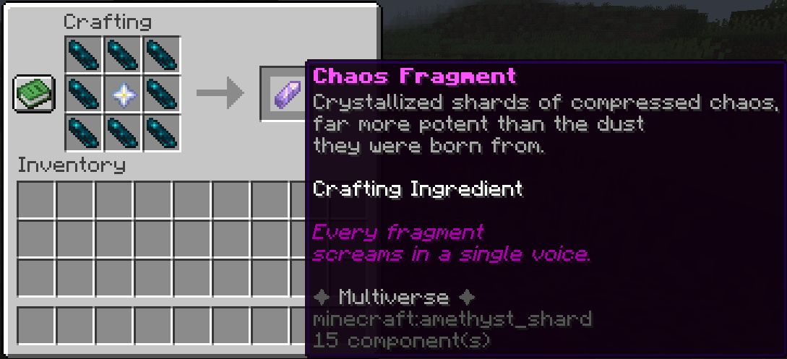

**Chaos Core** — `§d§lChaos Core` (END_CRYSTAL):
```
F O F
O S O
F O F
```

- `F` = Chaos Fragment (exact), `O` = Chaos Orb (exact), `S` = NETHER_STAR

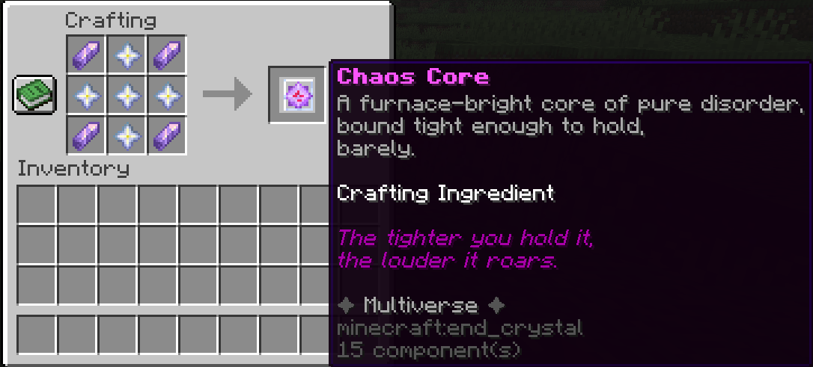

**Condensed Chaos Orb** — `§d§lCondensed Chaos Orb` (NETHER_STAR):
```
C O C
O S O
C O C
```

- `C` = Chaos Core (exact), `O` = Chaos Orb (exact), `S` = NETHER_STAR


### Compressed Gold Block
**Result:** `§6§lCompressed Gold Block` (GOLD_BLOCK) — 9× Gold Block.

```
G G G
G G G
G G G
```

- `G` = GOLD_BLOCK


### Refined Netherite
**Result:** `§8§lRefined Netherite` (NETHERITE_INGOT) — smithing ritual anchored by compressed gold.

```
S N S
N G N
S N S
```

- `S` = Star Core (exact)
- `N` = NETHERITE_SCRAP
- `G` = Compressed Gold Block (exact) *(9 Gold Blocks)*

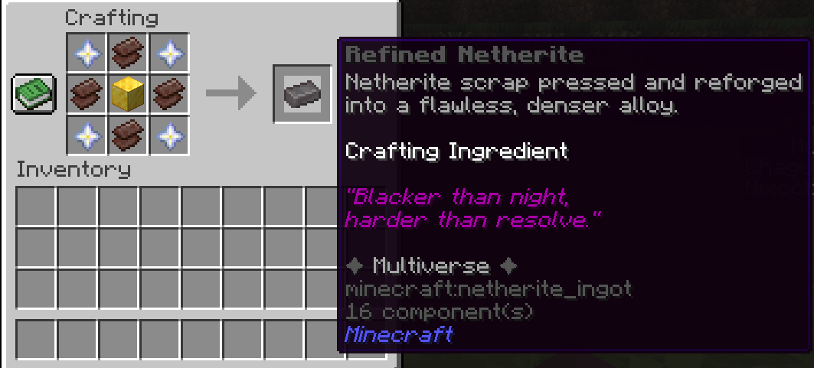

### Wheel Core
**Result:** `§6§lWheel Core` (MUSIC_DISC_OTHERSIDE) — must then be **smelted in a Blast Furnace**.

```
W D W
D E D
W D W
```

- `W` = Wheel Essence (exact), `D` = DIAMOND_BLOCK, `E` = NETHER_STAR


### Molten Wheel Core *(Furnace / Blast Furnace)*
**Result:** `§6§lMolten Wheel Core` (BLAZE_POWDER) — Wheel Core held past its melting point.

**Input:** Wheel Core (exact) — smelts only in a **Blast Furnace** (`BlastingRecipe`, 100 ticks, 0.5 XP).

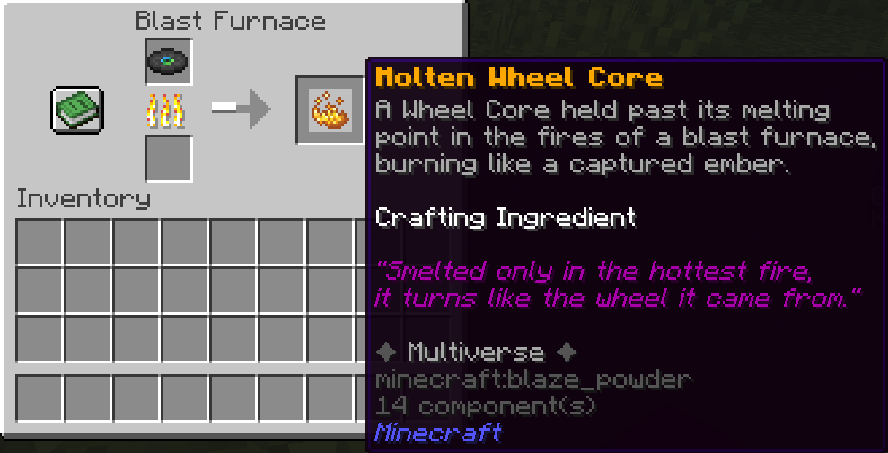

### Molten Netherite *(Furnace / Blast Furnace)*
**Result:** `§8§lMolten Netherite` (ANCIENT_DEBRIS) — Refined Netherite reduced in the **same crucible**.

**Input:** Refined Netherite (exact) — smelts only in a **Blast Furnace** (`BlastingRecipe`, 100 ticks, 0.5 XP).


### Refined Wheel Core
**Result:** `§6§lRefined Wheel Core` (MUSIC_DISC_OTHERSIDE) — the molten wheel and molten netherite poured into each other.

```
A B
```

- `A` = Molten Wheel Core (exact)
- `B` = Molten Netherite (exact)


### Reaper Core
**Result:** `§0§lReaper Core` (WITHER_ROSE) — intermediate for the Soulreap Scythe.

```
R N R
N S N
R N R
```

- `R` = Reaper Essence (exact), `N` = SOUL_SAND, `S` = NETHER_STAR

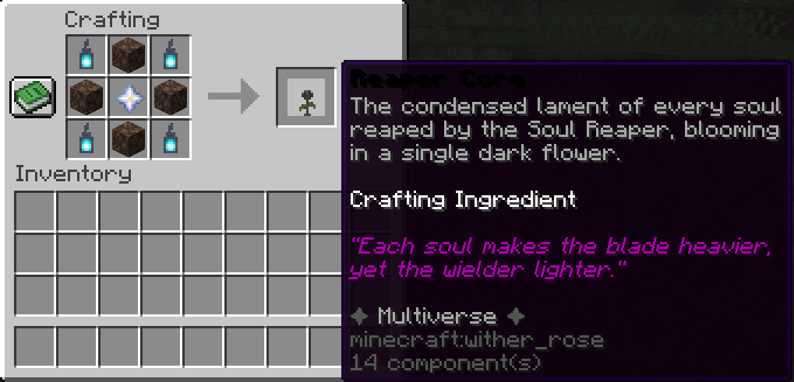

### Sentinel Core ⚔️ *(boss drop — not craftable)*
**Result:** `§5§lSentinel Core` (HEART_OF_THE_SEA) — dropped by the **Obsidian Sentinel** on death.

- Drop chance: `armor-stand-boss.sentinel-core-drop-chance` in `config.yml` (default `100.0`).
- Also, obtainable via `/msc give sentinelcore`.

*(No crafting photo — boss drop)*

### Multiversal Core
**Result:** `§6§lMultiversal Core` (TOTEM_OF_UNDYING) — apex component, ingredient for future legendary items.

```
N S N
S R S
N S N
```

- `N` = Refined Netherite (exact)
- `S` = Star Core (exact)
- `R` = Sentinel Core (exact) *(boss drop)*

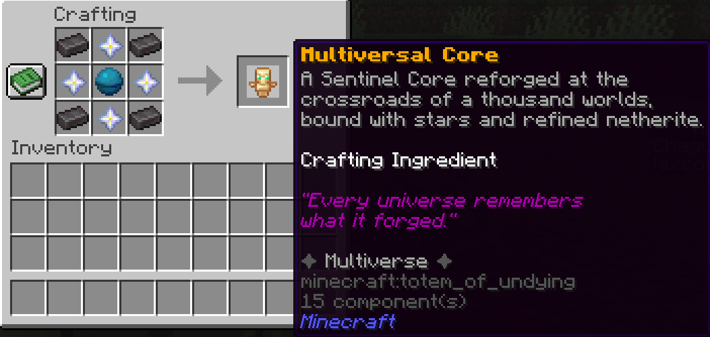

---

## 🗡️ Weapons

### Venomfang (low tier)
**Result:** `§2§lVenomfang` (IRON_SWORD) — venom dagger.

```
G V G
V M V
V S V
```

- `G` = GOLD_BLOCK, `V` = Venom Gland (exact), `M` = Sword Mold (exact), `S` = STICK

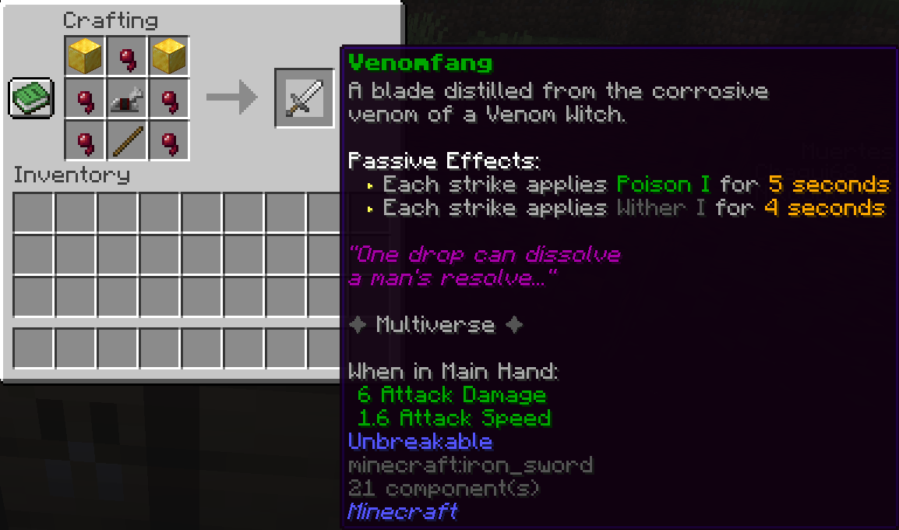

### Skyfire Talisman (mid tier)
**Result:** `§e§lSkyfire Talisman` (COPPER_INGOT) — mid-tier magic item.

```
S G S
G Q G
S G S
```

- `S` = Storm Crystal (exact), `G` = GOLD_BLOCK, `Q` = QUARTZ


### Soulreap Scythe (high tier)
First craft a **Reaper Core** (above), then:

**Result:** `§0§lSoulreap Scythe` (NETHERITE_HOE):
```
. R .
C R .
N S .
```

- `R` = Reaper Core (exact), `C` = SOUL_SAND, `N` = NETHERITE_INGOT, `S` = STICK


### Aether Pullshot (high tier)
**Result:** `§3§lAether Pullshot` (TRIDENT).

```
D F D
E F E
D S D
```

- `D` = DIAMOND_BLOCK, `F` = END_CRYSTAL, `E` = Ender Fragment (exact), `S` = STICK

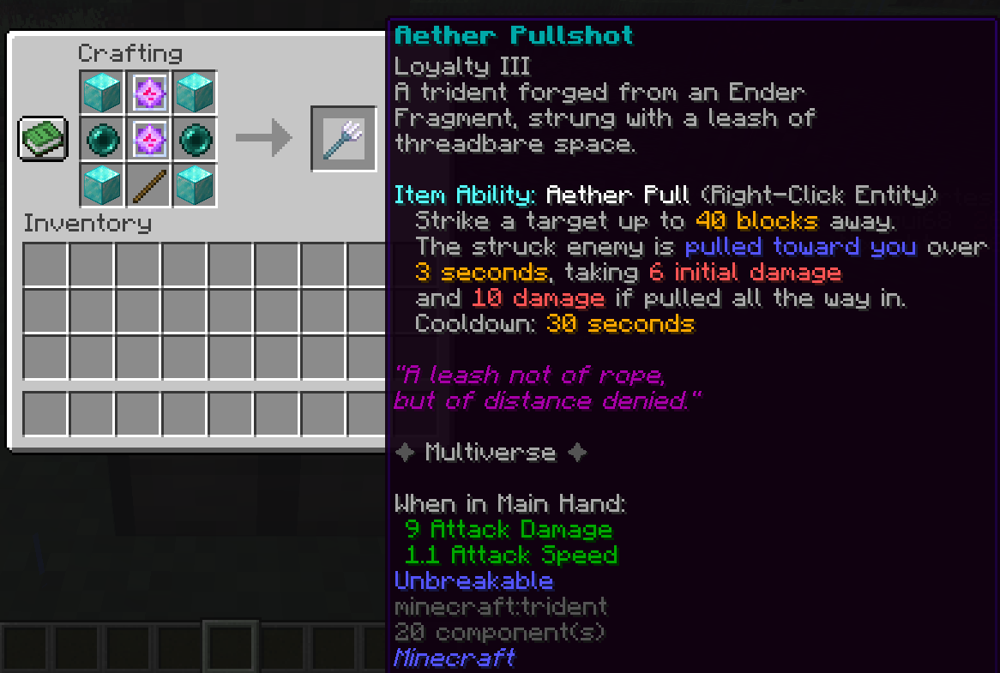

### Nullshear Edge (high tier)
**Result:** `§5§lNullshear Edge` (NETHERITE_SWORD).

```
V V V
V E V
N M N
```

- `V` = Void Essence (exact), `E` = Ender Core (exact), `N` = NETHERITE_INGOT, `M` = Sword Mold (exact)

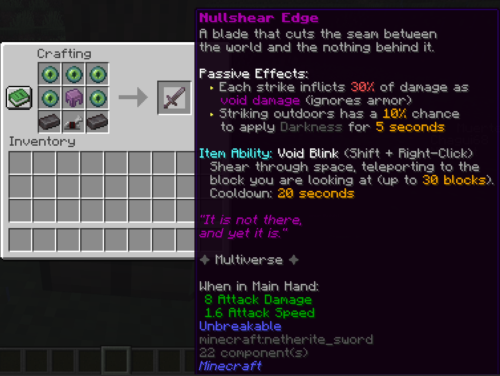

### Cinder Greatsword (very high tier)
**Result:** `§6§lCinder Greatsword` (NETHERITE_SWORD) — magma-forged greatsword.

```
M M M
M C M
N . N
```

- `M` = Magma Core (exact), `C` = COAL_BLOCK, `N` = NETHERITE_INGOT


### Chaos Forge (reforge tool)
**Result:** `§d§lChaos Forge` (ANVIL) — reforge items for stat rerolls.

```
C C C
O N O
O N O
```

- `C` = Chaos Orb (exact), `O` = OBSIDIAN, `N` = NETHERITE_INGOT


### Sentinel Grimoire (apex weapon — book of spells)
**Result:** `§e§lSentinel Grimoire` (ENCHANTED_BOOK) — 8 pages of spells, `Shift + Right-Click` to change page, `Right-Click` to cast. Each spell has its own seal and cooldown (configurable under `grimoire:` in config.yml).

```
. B .
M S M
. B .
```

- `B` = BOOK, `M` = Multiversal Core (exact), `S` = Sentinel Core (exact) *(boss drop)*

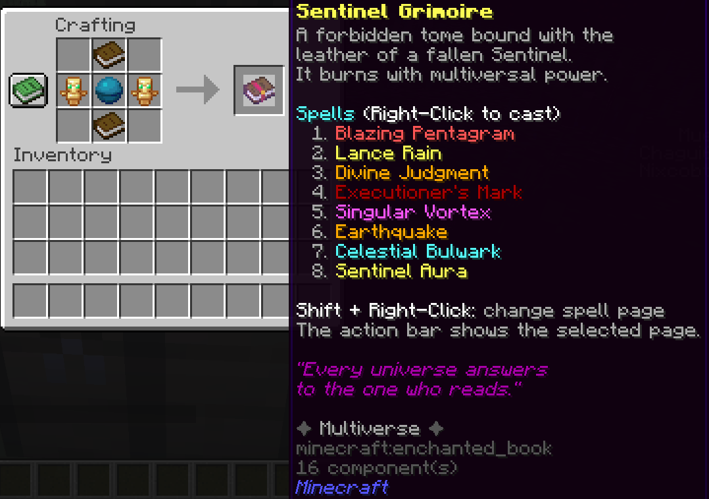

Spells: 1️⃣ Blazing Pentagram · 2️⃣ Lance Rain · 3️⃣ Divine Judgment · 4️⃣ Executioner's Mark · 5️⃣ Singular Vortex · 6️⃣ Earthquake · 7️⃣ Celestial Bulwark · 8️⃣ Sentinel Aura

---

## 🛡️ Armor & off-hand relics

### Frost Heart (off-hand, low tier)
**Result:** `§b§lFrost Heart` (LIGHT_BLUE_DYE) off-hand relic.

```
I B I
B H B
I B I
```

- `I` = IRON_BLOCK, `B` = BLUE_ICE, `H` = Frost Heart (exact)

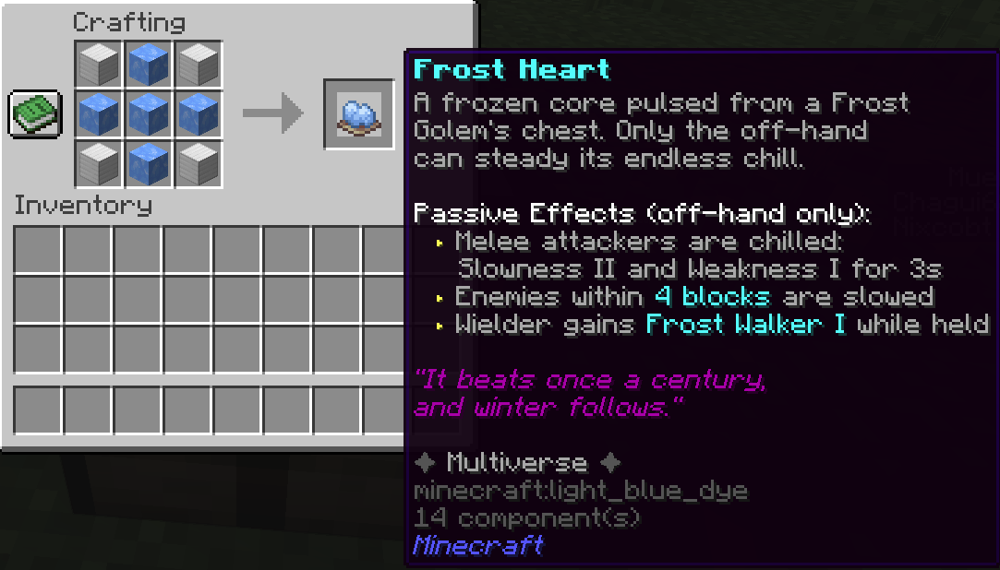

### Marrow Aegis (high tier)
The full shield chain:

**Bone Marrow** — `§f§lBone Marrow` (BONE_MEAL):
```
B R B
B W B
B R B
```

- `B` = Reinforced Bone (exact), `R` = REDSTONE_BLOCK, `W` = NETHER_WART (8 bones per marrow)

**Ossified Plate** — `§f§lOssified Plate` (CALCITE):
```
C M C
M D M
C M C
```

- `C` = CALCITE, `M` = Bone Marrow (exact), `D` = DIAMOND

**Molten Marrow** — `§6§lMolten Marrow` (REDSTONE): an Ossified Plate held past its melting point. **Blast Furnace only** (`BlastingRecipe`, 100 ticks, 0.5 XP) — a regular furnace will not work.

**Final result:** `§f§lMarrow Aegis` (SHIELD) — bone shield:
```
D P D
P M P
D P D
```

- `D` = DIAMOND_BLOCK, `P` = Ossified Plate (exact), `M` = Molten Marrow (exact)

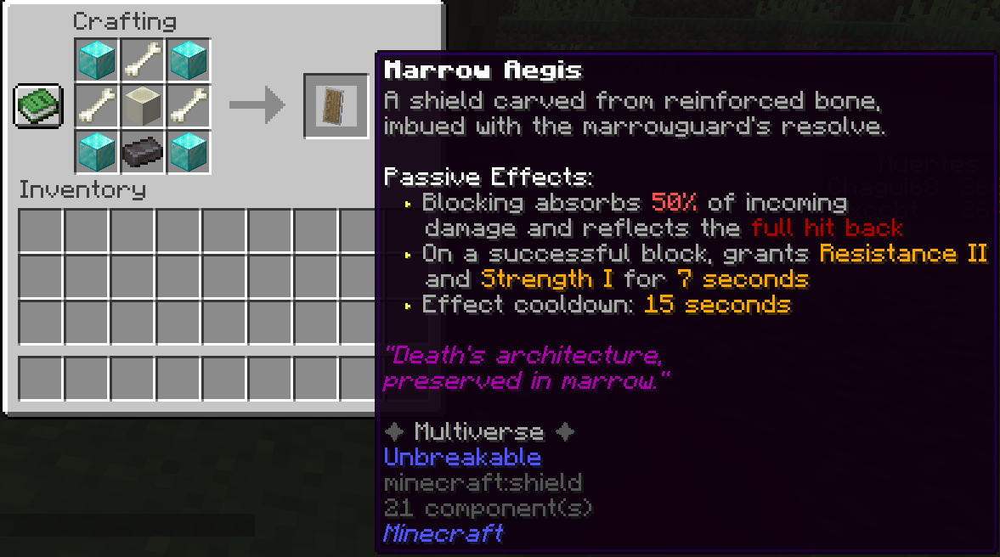

### Eight-Handled Wheel (very high tier helmet)
First smelt and refine a **Refined Wheel Core** (above), then:

**Result:** `§6§lEight-Handled Wheel` (NETHERITE_HELMET) helmet:

```
. N .
N W N
. N .
```

- `N` = NETHERITE_BLOCK
- `W` = Refined Wheel Core (exact)


### Veilwalker Mantle (off-hand, high tier)
**Result:** `§8§lVeilwalker Mantle` (CLOCK) — shadow cloak relic.

```
S G S
G N G
S G S
```

- `S` = Shadow Cloak (exact), `G` = GOLD_BLOCK, `N` = NETHER_STAR

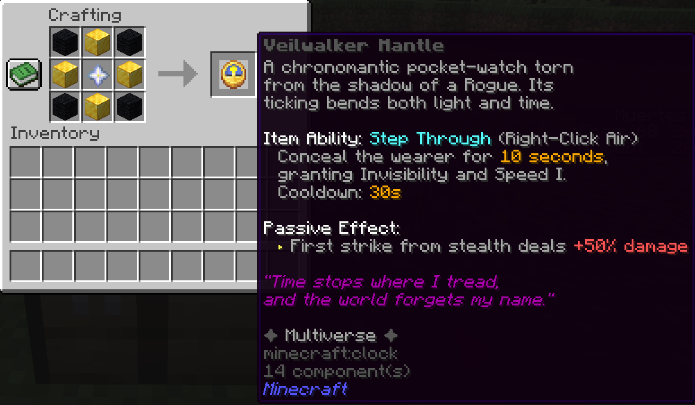

### Obsidian Bastion (very high tier set)
First craft **Refined Netherite** (above), then each piece with **Obsidian Shard** (`O`) + **Refined Netherite** (`N`):

**Helmet:**

```
O N O
O . O
O . O
```


**Chestplate** (`B` = DIAMOND_BLOCK):
```
O N O
O B O
O O O
```


**Leggings:**
```
O N O
O . O
O . O
```


**Boots:**
```
O . O
O N O
```

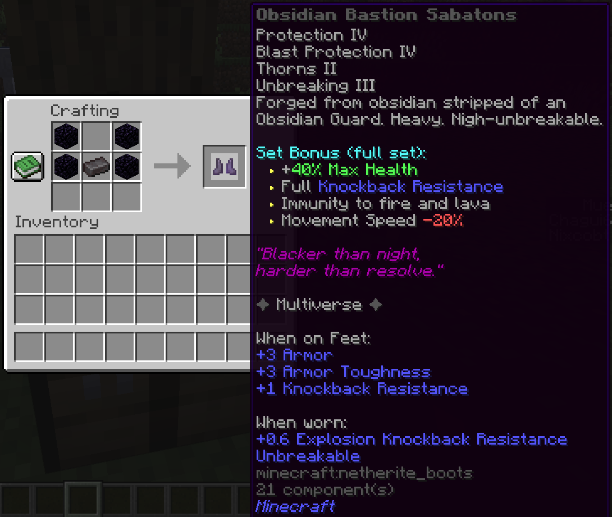

---

## 🍖 Food & gadgets

### Head Slime Gelatin
**Result:** `§a§lHead Slime Gelatin` (MAGENTA_GLAZED_TERRACOTTA) — slime kingdom food.

```
A S A
S H S
A S A
```

- `A` = APPLE, `S` = SLIME_BALL, `H` = Head Slime Heart (exact)


### Military Mine
**Result:** `§a§lMilitary Mine` (TNT) — camouflaged TNT.

```
I M I
M T M
I M I
```

- `I` = IRON_BLOCK, `T` = TNT, `M` = Military Component (exact)

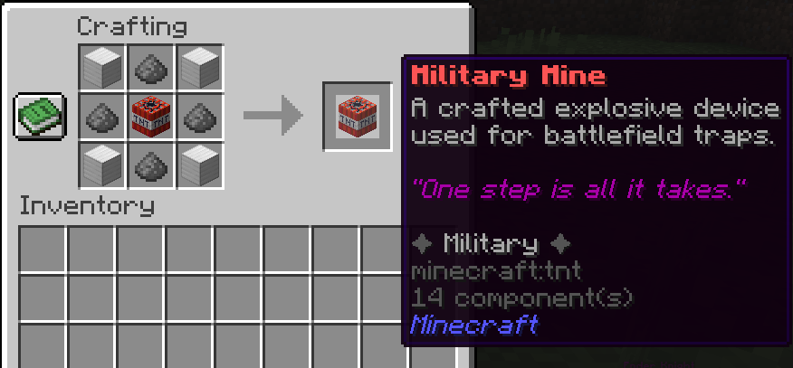

---

## 📋 Summary table

| Recipe | Key (namespace `multiversecreatures`) | Difficulty |
|---|---|---|
| Star Core | `star_core` | mid |
| Sword Mold | `sword_mold` | low |
| Reinforced Bone Block | `reinforced_bone_block` | low |
| Ender Core | `ender_core` | mid |
| Chaos Powder / Fragment / Core / Condensed Orb | `chaos_powder` `chaos_fragment` `chaos_core` `condensed_chaos_orb` | mid→high |
| Refined Netherite | `refined_netherite` | high (4× Star Core + scrap + compressed gold) |
| Compressed Gold Block | `compressed_gold_block` | mid |
| Wheel Core | `wheel_core` | high |
| Bone Marrow | `bone_marrow` | mid (8× Reinforced Bone) |
| Ossified Plate | `ossified_plate` | mid-high |
| Molten Marrow | `molten_marrow_blast` | high *(Blast Furnace ONLY)* |
| Molten Wheel Core | `molten_wheel_core` | high *(any furnace)* |
| Molten Netherite | `molten_netherite` | high *(any furnace)* |
| Refined Wheel Core | `refined_wheel_core` | very high |
| Reaper Core | `reaper_core` | high |
| **Multiversal Core** | `multiversal_core` | **apex** (needs boss drop) |
| Venomfang | `venomfang` | low |
| Skyfire Talisman | `skyfire_talisman` | mid |
| Soulreap Scythe | `soulreap_scythe` | high |
| Aether Pullshot | `aether_pullshot` | high |
| Nullshear Edge | `nullshear_edge` | high |
| Cinder Greatsword | `cinder_greatsword` | very high |
| **Sentinel Grimoire** | `sentinel_grimoire` | **apex** (needs boss drop) |
| Chaos Forge | `chaos_forge` | high |
| Frost Heart (off-hand) | `frost_heart_offhand` | low |
| Marrow Aegis | `marrow_aegis` | high (3-component chain + Blast Furnace) |
| Eight-Handled Wheel | `eight_handled_wheel` | high |
| Veilwalker Mantle | `veilwalker_mantle` | high |
| Obsidian Bastion (×4) | `obsidian_bastion_*` | very high |
| Head Slime Gelatin | `head_slime_gelatin` | low |
| Military Mine | `military_mine` | mid |

**Not craftable:** Sentinel Core — boss-only drop (Obsidian Sentinel).

---

## 🛒 No recipe — obtained without crafting

These items intentionally have **no crafting recipe**. They come from drops or the **Multiverse Merchant** (a Wandering Trader replacement, 30% of trader spawns — see [Creatures](./Creatures.md)):

| Item | How to obtain |
|---|---|
| **Excalibur** (NETHERITE_SWORD) | Trade: 16 Star Cores + 32 Netherite Ingots (`MobHandler.equipWanderingVillager`) |
| **Ice King's Crown** | Trade: 48 Nether Stars + 64 Blue Ice |
| **Wirt's Lantern** | Trade: 32 Soul Sand + 16 Soul Soil |
| **Mantis Claws** | Trade: 16 Iron Ingots + 8 String |
| **Scooby Cookie** (×5) | Trade: 20 Diamonds |
| **Dio's Stand Head** | Drop from the **Dio Boss** (miniboss) |

See [Components](./Components.md) for drop sources and [Weapons](./Weapons.md) / [Armor-and-Relics](./Armor-and-Relics.md) for item details.
