# 🔨 Recetas Personalizadas

Todas las recetas del plugin se declaran en `RecipeManager.java` (`items/recipes/RecipeManager.java`) como `ShapedRecipe`s sin shapeless con elecciones de objetos exactas, por lo que los componentes crafteados en otra parte de la cadena se requieren tal cual (misma etiqueta NBT).

Las cuadrículas de abajo usan filas de crafteo 3×3; `.` significa **ranura vacía**.

*Todas las fotos de recetas están en `images/recipes/` — cada una muestra la UI de crafteo del juego.*

---

## 🏗️ Componentes intermedios

### Núcleo Estelar
**Resultado:** `§e§lStar Core` (NETHER_STAR) — el corazón de una estrella caída.

```
N B N
B S B
N B N
```

- `N` = NETHERITE_BLOCK
- `B` = DIAMOND_BLOCK
- `S` = NETHER_STAR

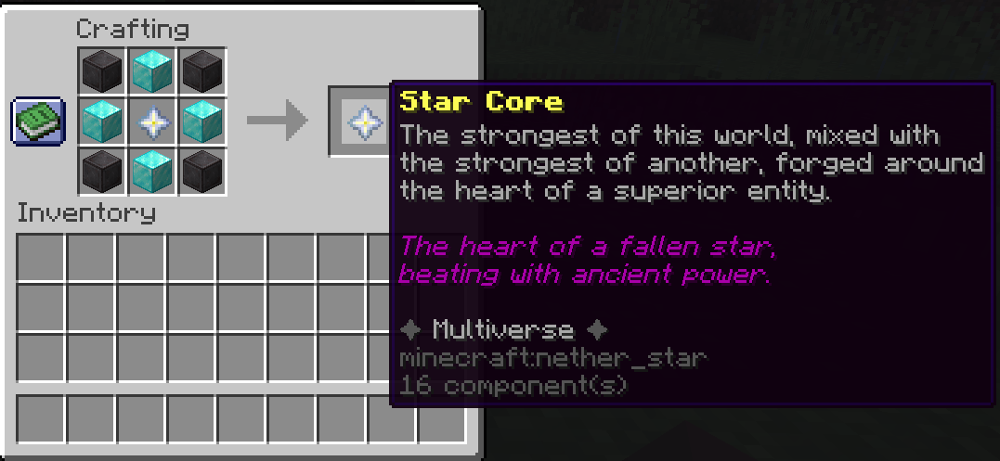

### Molde de Espada
**Resultado:** `§f§lSword Mold` (IRON_HORSE_ARMOR) — forma base para armas de hoja.

```
I A I
A I A
I A I
```

- `I` = IRON_INGOT
- `A` = IRON_BLOCK


### Bloque de Hueso Reforzado
**Resultado:** `§f§lReinforced Bone Block` (BONE_BLOCK) — 9× Hueso Reforzado.

```
R R R
R R R
R R R
```

- `R` = Hueso Reforzado (exacto)

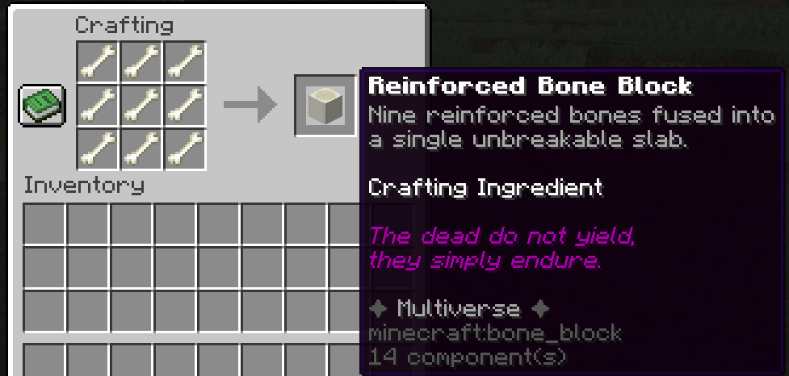

### Núcleo Ender
**Resultado:** `§3§lEnder Core` (SHULKER_SHELL) — intermedio para armas de nivel ender.

```
D F D
F N F
D F D
```

- `D` = DIAMOND
- `F` = Fragmento Ender (exacto)
- `N` = NETHER_STAR


### Cadena de compresión del Caos
El Orbe del Caos se usa como "pegamento" en cada paso:

**Polvo del Caos** — `§4§lChaos Powder` (ECHO_SHARD):
```
. G .
G O G
. G .
```

- `G` = GLOWSTONE_DUST, `O` = Orbe del Caos (exacto)


**Fragmento del Caos** — `§4§lChaos Fragment` (AMETHYST_SHARD):
```
P P P
P O P
P P P
```

- `P` = Polvo del Caos (exacto), `O` = Orbe del Caos (exacto)


**Núcleo del Caos** — `§d§lChaos Core` (END_CRYSTAL):
```
F O F
O S O
F O F
```

- `F` = Fragmento del Caos (exacto), `O` = Orbe del Caos (exacto), `S` = NETHER_STAR


**Orbe del Caos Condensado** — `§d§lCondensed Chaos Orb` (NETHER_STAR):
```
C O C
O S O
C O C
```

- `C` = Núcleo del Caos (exacto), `O` = Orbe del Caos (exacto), `S` = NETHER_STAR

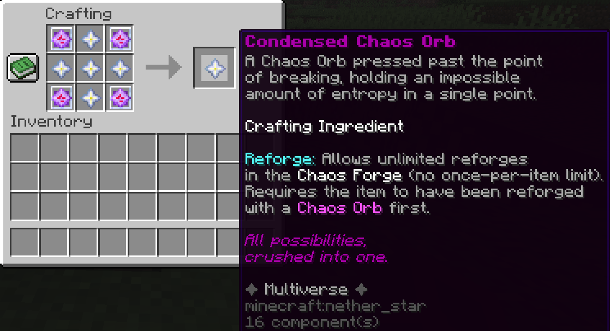

### Bloque de Oro Comprimido
**Resultado:** `§6§lCompressed Gold Block` (GOLD_BLOCK) — 9× Bloque de Oro.

```
G G G
G G G
G G G
```

- `G` = GOLD_BLOCK

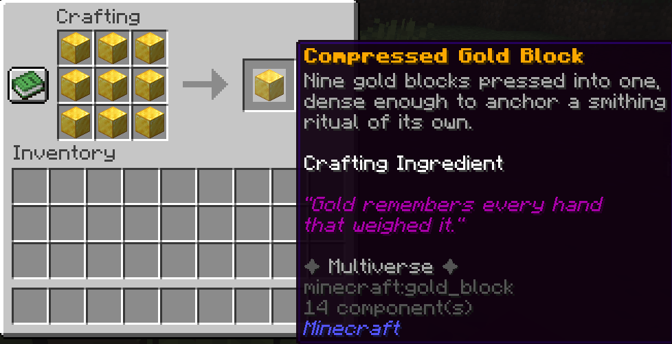

### Netherita Refinada
**Resultado:** `§8§lRefined Netherite` (NETHERITE_INGOT) — ritual de herrería anclado por oro comprimido.

```
S N S
N G N
S N S
```

- `S` = Núcleo Estelar (exacto)
- `N` = NETHERITE_SCRAP
- `G` = Bloque de Oro Comprimido (exacto) *(9 Bloques de Oro)*


### Núcleo de Rueda
**Resultado:** `§6§lWheel Core` (MUSIC_DISC_OTHERSIDE) — después debe **fundirse en un Alto Horno**.

```
W D W
D E D
W D W
```

- `W` = Esencia de Rueda (exacta), `D` = DIAMOND_BLOCK, `E` = NETHER_STAR

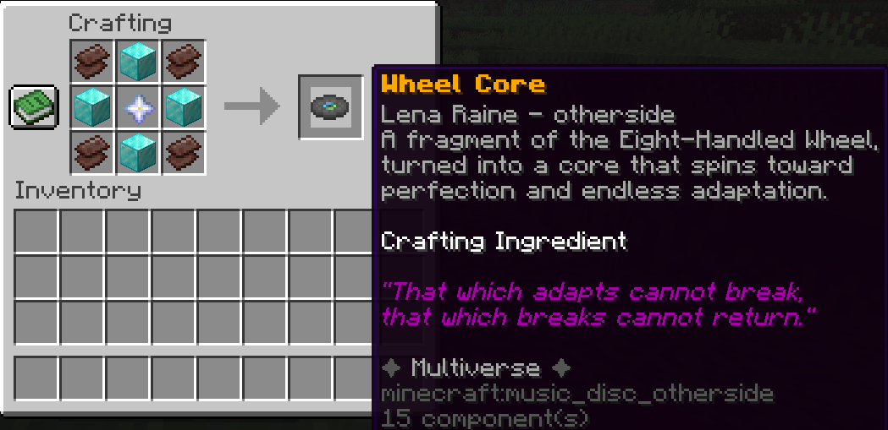

### Núcleo de Rueda Fundido *(Horno / Alto Horno)*
**Resultado:** `§6§lMolten Wheel Core` (BLAZE_POWDER) — el Núcleo de Rueda llevado más allá de su punto de fusión.

**Entrada:** Núcleo de Rueda (exacto) — solo se funde en un **Alto Horno** (`BlastingRecipe`, 100 ticks, 0.5 XP).


### Netherita Fundida *(Horno / Alto Horno)*
**Resultado:** `§8§lMolten Netherite` (ANCIENT_DEBRIS) — Netherita Refinada reducida en el **mismo crisol**.

**Entrada:** Netherita Refinada (exacta) — solo se funde en un **Alto Horno** (`BlastingRecipe`, 100 ticks, 0.5 XP).

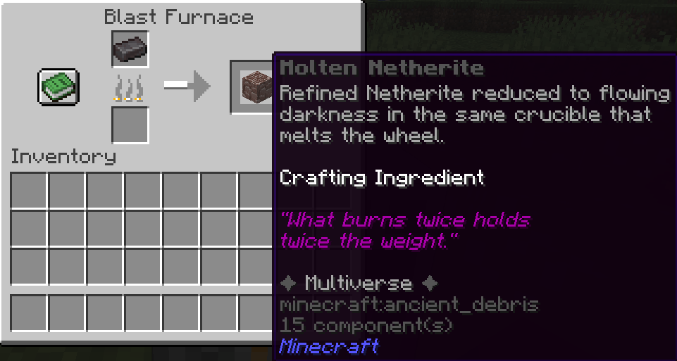

### Núcleo de Rueda Refinado
**Resultado:** `§6§lRefined Wheel Core` (MUSIC_DISC_OTHERSIDE) — la rueda fundida y la netherita fundida vertidas una en otra.

```
A B
```

- `A` = Núcleo de Rueda Fundido (exacto)
- `B` = Netherita Fundida (exacta)

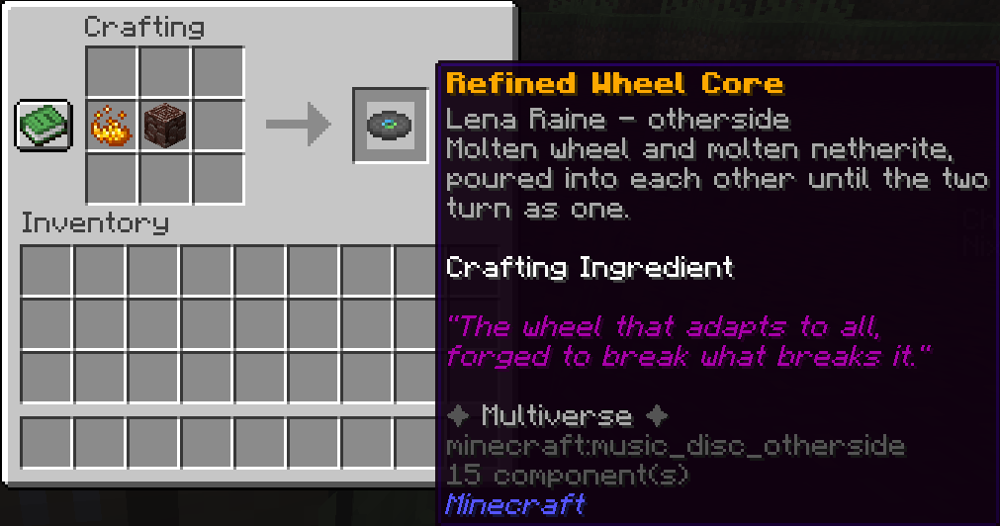

### Núcleo de Segador
**Resultado:** `§0§lReaper Core` (WITHER_ROSE) — intermedio para la Guadaña Soulreap.

```
R N R
N S N
R N R
```

- `R` = Esencia de Segador (exacta), `N` = SOUL_SAND, `S` = NETHER_STAR


### Núcleo Centinela ⚔️ *(drop de jefe — no crafteable)*
**Resultado:** `§5§lSentinel Core` (HEART_OF_THE_SEA) — dropeado por el **Centinela de Obsidiana** al morir.

- Probabilidad de drop: `armor-stand-boss.sentinel-core-drop-chance` en `config.yml` (por defecto `100.0`).
- También se obtiene vía `/msc give sentinelcore`.

*(Sin foto de crafteo — drop de jefe)*

### Núcleo Multiversal
**Resultado:** `§6§lMultiversal Core` (TOTEM_OF_UNDYING) — componente cumbre, ingrediente de futuros objetos legendarios.

```
N S N
S R S
N S N
```

- `N` = Netherita Refinada (exacta)
- `S` = Núcleo Estelar (exacto)
- `R` = Núcleo Centinela (exacto) *(drop de jefe)*


---

## 🗡️ Armas

### Venomfang (nivel bajo)
**Resultado:** `§2§lVenomfang` (IRON_SWORD) — daga de veneno.

```
G V G
V M V
V S V
```

- `G` = GOLD_BLOCK, `V` = Glándula de Veneno (exacta), `M` = Molde de Espada (exacto), `S` = STICK


### Talismán Skyfire (nivel medio)
**Resultado:** `§e§lSkyfire Talisman` (COPPER_INGOT) — objeto mágico de nivel medio.

```
S G S
G Q G
S G S
```

- `S` = Cristal de Tormenta (exacto), `G` = GOLD_BLOCK, `Q` = QUARTZ

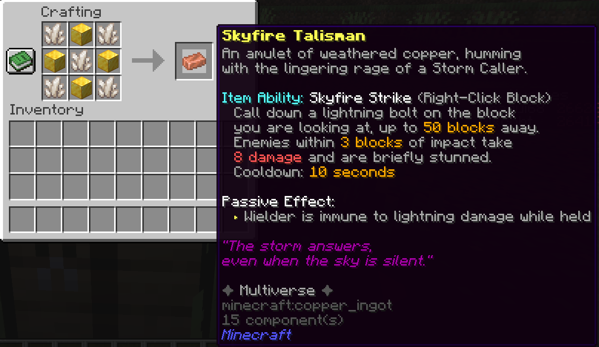

### Guadaña Soulreap (nivel alto)
Primero craftea un **Núcleo de Segador** (arriba), luego:

**Resultado:** `§0§lSoulreap Scythe` (NETHERITE_HOE):
```
. R .
C R .
N S .
```

- `R` = Núcleo de Segador (exacto), `C` = SOUL_SAND, `N` = NETHERITE_INGOT, `S` = STICK

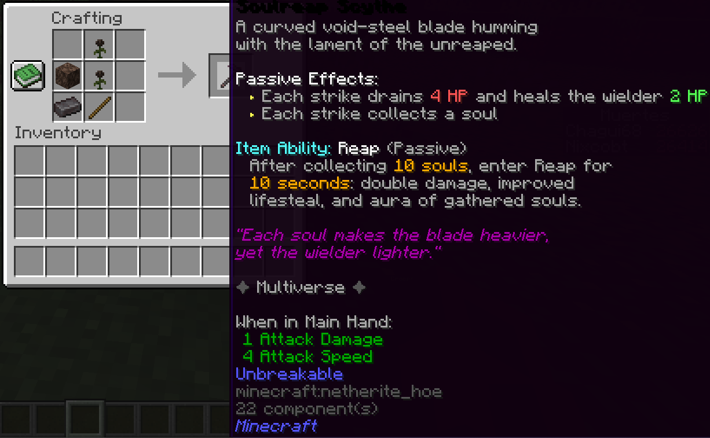

### Aether Pullshot (nivel alto)
**Resultado:** `§3§lAether Pullshot` (TRIDENT).

```
D F D
E F E
D S D
```

- `D` = DIAMOND_BLOCK, `F` = END_CRYSTAL, `E` = Fragmento Ender (exacto), `S` = STICK


### Filo Nullshear (nivel alto)
**Resultado:** `§5§lNullshear Edge` (NETHERITE_SWORD).

```
V V V
V E V
N M N
```

- `V` = Esencia del Vacío (exacta), `E` = Núcleo Ender (exacto), `N` = NETHERITE_INGOT, `M` = Molde de Espada (exacto)


### Gran Espada de Ascuas (nivel muy alto)
**Resultado:** `§6§lCinder Greatsword` (NETHERITE_SWORD) — gran espada forjada en magma.

```
M M M
M C M
N . N
```

- `M` = Núcleo de Magma (exacto), `C` = COAL_BLOCK, `N` = NETHERITE_INGOT

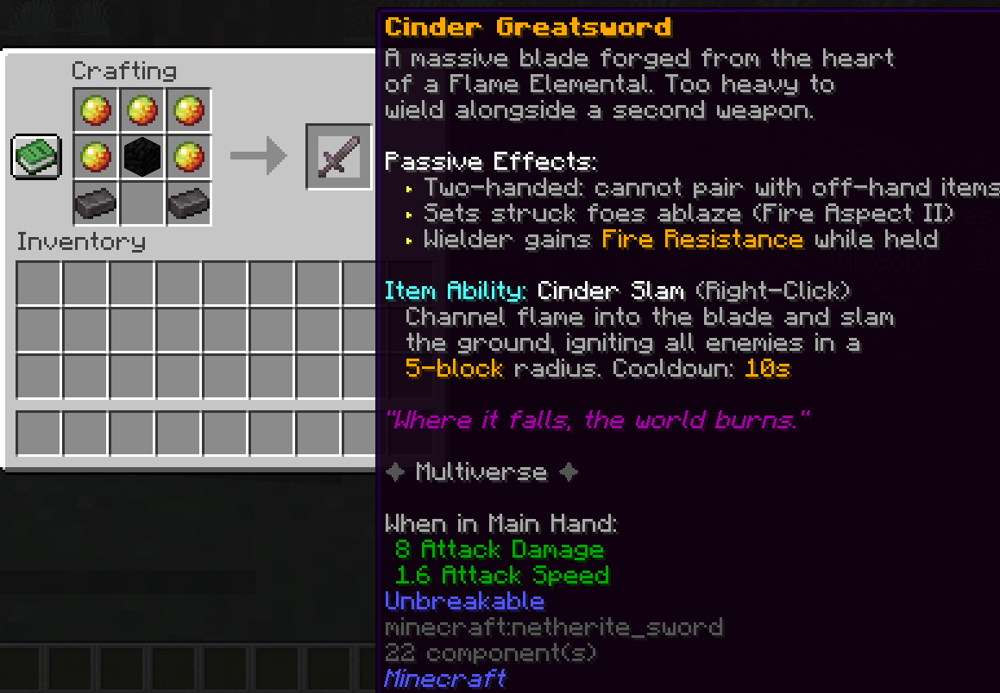

### Forja del Caos (herramienta de re-forja)
**Resultado:** `§d§lChaos Forge` (ANVIL) — re-forja objetos para re-tirar estadísticas.

```
C C C
O N O
O N O
```

- `C` = Orbe del Caos (exacto), `O` = OBSIDIAN, `N` = NETHERITE_INGOT

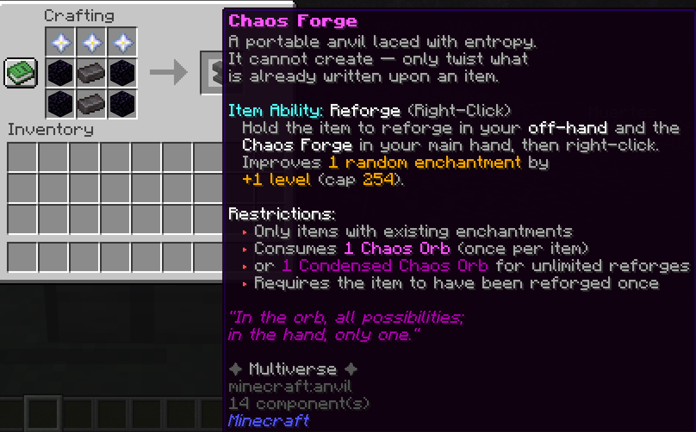

### Grimorio Centinela (arma cumbre — libro de hechizos)
**Resultado:** `§e§lSentinel Grimoire` (ENCHANTED_BOOK) — 8 páginas de hechizos, `Shift + Click derecho` para cambiar de página, `Click derecho` para lanzar. Cada hechizo tiene su propio sello y cooldown (configurable bajo `grimoire:` en config.yml).

```
. B .
M S M
. B .
```

- `B` = BOOK, `M` = Núcleo Multiversal (exacto), `S` = Núcleo Centinela (exacto) *(drop de jefe)*


Hechizos: 1️⃣ Pentagrama Ardiente · 2️⃣ Lluvia de Lanzas · 3️⃣ Juicio Divino · 4️⃣ Marca del Verdugo · 5️⃣ Vórtice Singular · 6️⃣ Terremoto · 7️⃣ Baluarte Celestial · 8️⃣ Aura Centinela

---

## 🛡️ Armaduras y reliquias de mano secundaria

### Corazón de Escarcha (mano secundaria, nivel bajo)
**Resultado:** `§b§lFrost Heart` (LIGHT_BLUE_DYE) — reliquia de mano secundaria.

```
I B I
B H B
I B I
```

- `I` = IRON_BLOCK, `B` = BLUE_ICE, `H` = Corazón de Escarcha (exacto)


### Marrow Aegis (nivel alto)
La cadena completa del escudo:

**Médula de Hueso** — `§f§lBone Marrow` (BONE_MEAL):
```
B R B
B W B
B R B
```

- `B` = Hueso Reforzado (exacto), `R` = REDSTONE_BLOCK, `W` = NETHER_WART (8 huesos por médula)

**Placa Osificada** — `§f§lOssified Plate` (CALCITE):
```
C M C
M D M
C M C
```

- `C` = CALCITE, `M` = Médula de Hueso (exacta), `D` = DIAMOND

**Médula Fundida** — `§6§lMolten Marrow` (REDSTONE): la Placa Osificada llevada más allá de su punto de fusión. **Solo se funde en un Alto Horno** (`BlastingRecipe`, 100 ticks, 0.5 XP) — no funciona en un horno normal.

**Resultado final:** `§f§lMarrow Aegis` (SHIELD) — escudo de hueso:
```
D P D
P M P
D P D
```

- `D` = DIAMOND_BLOCK, `P` = Placa Osificada (exacta), `M` = Médula Fundida (exacta)


### Rueda de Ocho Manos (casco de nivel muy alto)
Primero funde y refina un **Núcleo de Rueda Refinado** (arriba), luego:

**Resultado:** `§6§lEight-Handled Wheel` (NETHERITE_HELMET) — casco:

```
. N .
N W N
. N .
```

- `N` = NETHERITE_BLOCK
- `W` = Núcleo de Rueda Refinado (exacto)

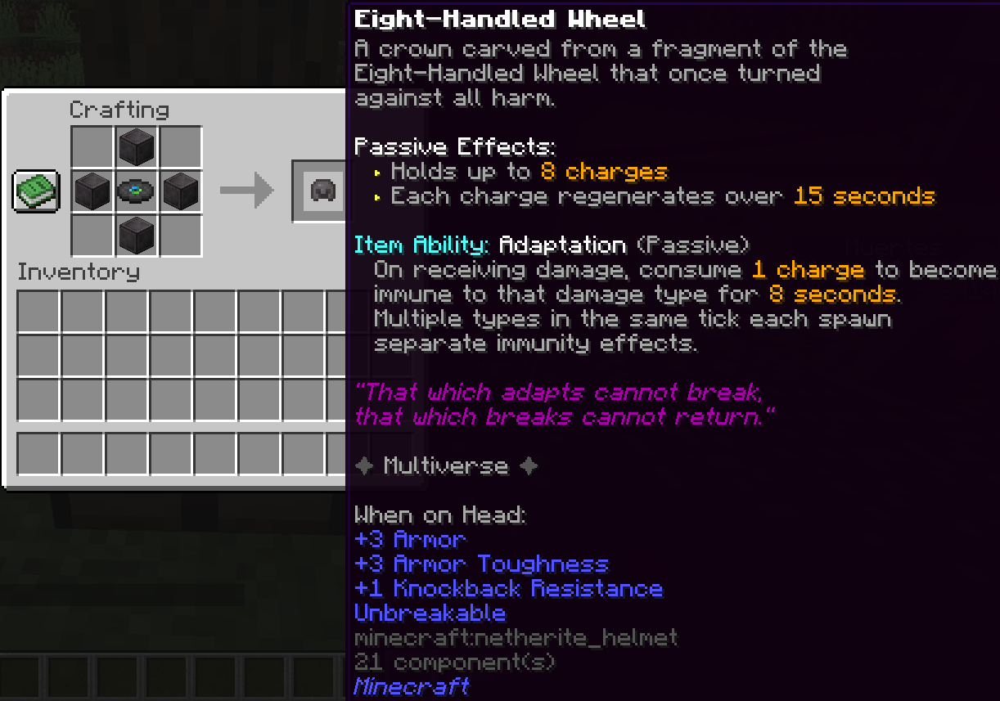

### Manto Veilwalker (mano secundaria, nivel alto)
**Resultado:** `§8§lVeilwalker Mantle` (CLOCK) — reliquia de capa de las sombras.

```
S G S
G N G
S G S
```

- `S` = Capa de las Sombras (exacta), `G` = GOLD_BLOCK, `N` = NETHER_STAR


### Bastión de Obsidiana (set de nivel muy alto)
Primero craftea **Netherita Refinada** (arriba), luego cada pieza con **Fragmento de Obsidiana** (`O`) + **Netherita Refinada** (`N`):

**Yelmo:**

```
O N O
O . O
O . O
```

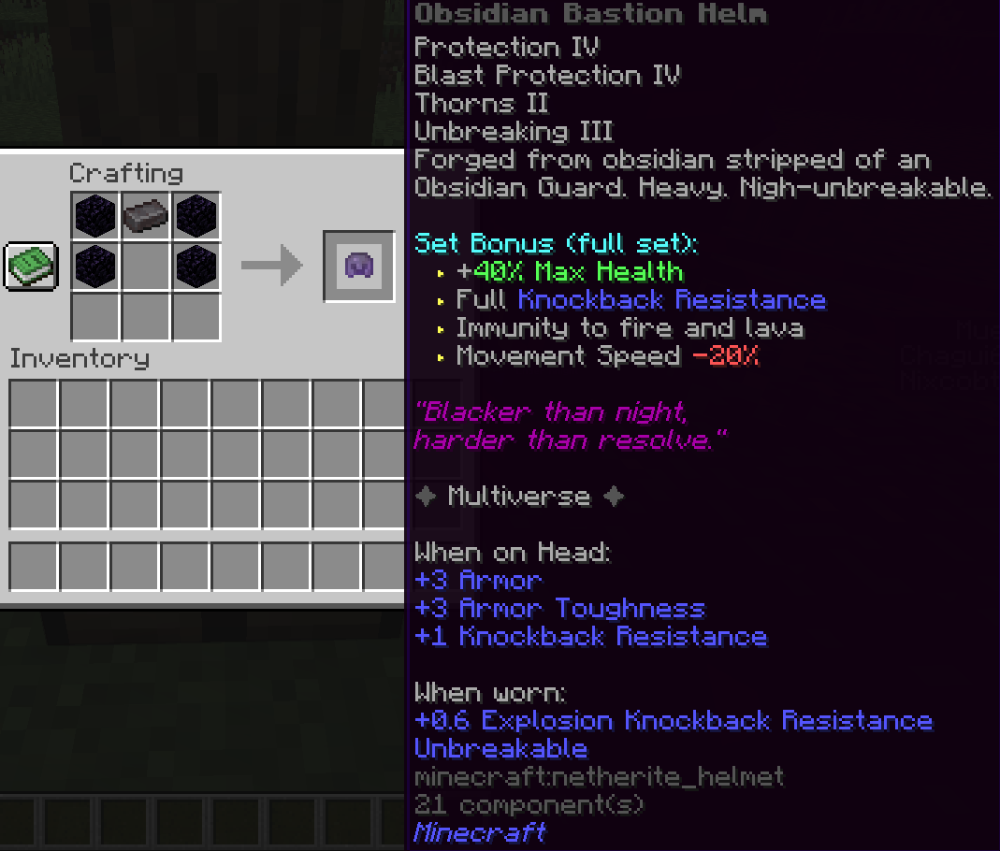

**Peto** (`B` = DIAMOND_BLOCK):
```
O N O
O B O
O O O
```

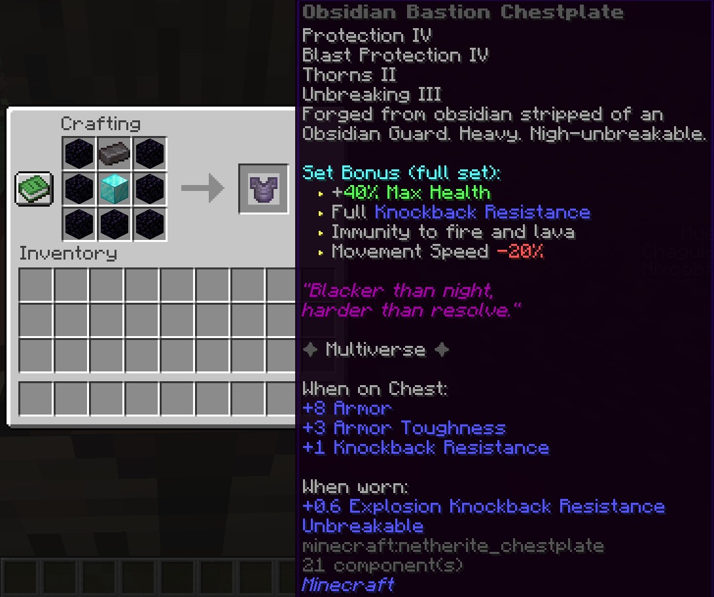

**Grebas:**
```
O N O
O . O
O . O
```

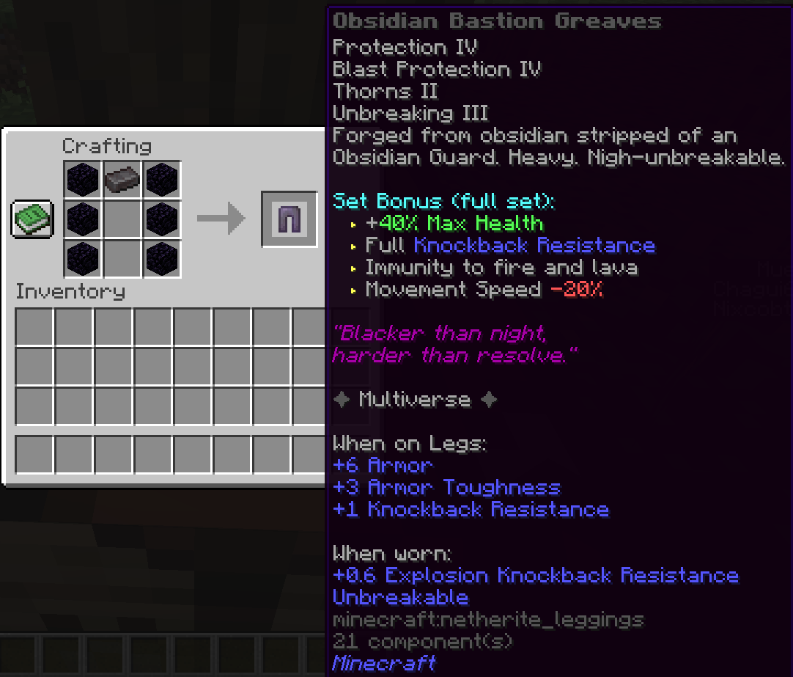

**Botas:**
```
O . O
O N O
```


---

## 🍖 Alimentos y artilugios

### Gelatina de Head Slime
**Resultado:** `§a§lHead Slime Gelatin` (MAGENTA_GLAZED_TERRACOTTA) — alimento del reino slime.

```
A S A
S H S
A S A
```

- `A` = APPLE, `S` = SLIME_BALL, `H` = Corazón de Head Slime (exacto)

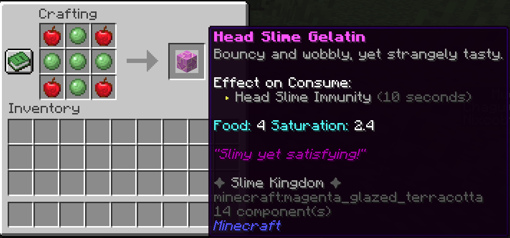

### Mina Militar
**Resultado:** `§a§lMilitary Mine` (TNT) — TNT camuflado.

```
I M I
M T M
I M I
```

- `I` = IRON_BLOCK, `T` = TNT, `M` = Componente Militar (exacto)


---

## 📋 Tabla resumen

| Receta | Clave (namespace `multiversecreatures`) | Dificultad |
|---|---|---|
| Núcleo Estelar | `star_core` | media |
| Molde de Espada | `sword_mold` | baja |
| Bloque de Hueso Reforzado | `reinforced_bone_block` | baja |
| Núcleo Ender | `ender_core` | media |
| Polvo / Fragmento / Núcleo / Orbe Condensado del Caos | `chaos_powder` `chaos_fragment` `chaos_core` `condensed_chaos_orb` | media→alta |
| Netherita Refinada | `refined_netherite` | alta (4× Núcleo Estelar + fragmento + oro comprimido) |
| Bloque de Oro Comprimido | `compressed_gold_block` | media |
| Médula de Hueso | `bone_marrow` | media (8× Hueso Reforzado) |
| Placa Osificada | `ossified_plate` | media-alta |
| Médula Fundida | `molten_marrow_blast` | alta *(SOLO Alto Horno)* |
| Núcleo de Rueda | `wheel_core` | alta |
| Núcleo de Rueda Fundido | `molten_wheel_core` | alta *(cualquier horno)* |
| Netherita Fundida | `molten_netherite` | alta *(cualquier horno)* |
| Núcleo de Rueda Refinado | `refined_wheel_core` | muy alta |
| Núcleo de Segador | `reaper_core` | alta |
| **Núcleo Multiversal** | `multiversal_core` | **cumbre** (necesita drop de jefe) |
| Venomfang | `venomfang` | baja |
| Talismán Skyfire | `skyfire_talisman` | media |
| Guadaña Soulreap | `soulreap_scythe` | alta |
| Aether Pullshot | `aether_pullshot` | alta |
| Filo Nullshear | `nullshear_edge` | alta |
| Gran Espada de Ascuas | `cinder_greatsword` | muy alta |
| **Grimorio Centinela** | `sentinel_grimoire` | **cumbre** (necesita drop de jefe) |
| Forja del Caos | `chaos_forge` | alta |
| Corazón de Escarcha (mano secundaria) | `frost_heart_offhand` | baja |
| Marrow Aegis | `marrow_aegis` | alta (cadena de 3 componentes + Alto Horno) |
| Rueda de Ocho Manos | `eight_handled_wheel` | alta |
| Manto Veilwalker | `veilwalker_mantle` | alta |
| Bastión de Obsidiana (×4) | `obsidian_bastion_*` | muy alta |
| Gelatina de Head Slime | `head_slime_gelatin` | baja |
| Mina Militar | `military_mine` | media |

**No crafteable:** Núcleo Centinela — drop exclusivo del jefe (Centinela de Obsidiana).

---

## 🛒 Sin receta — se obtiene sin craftear

Estos objetos intencionadamente **no tienen receta de crafteo**. Provienen de drops o del **Comerciante Multiversal** (un reemplazo del Comerciante Errante, 30% de los spawns de comerciante — ver [Criaturas](./Creatures.md)):

| Objeto | Cómo obtenerlo |
|---|---|
| **Excalibur** (NETHERITE_SWORD) | Intercambio: 16 Núcleos Estelares + 32 Lingotes de Netherita (`MobHandler.equipWanderingVillager`) |
| **Corona del Rey Helado** | Intercambio: 48 Estrellas del Nether + 64 Hielo Azul |
| **Linterna de Wirt** | Intercambio: 32 Arena de Almas + 16 Tierra de Almas |
| **Garras de Mantis** | Intercambio: 16 Lingotes de Hierro + 8 Cuerdas |
| **Galleta de Scooby** (×5) | Intercambio: 20 Diamantes |

Ver [Componentes](./Components.md) para las fuentes de drop y [Armas](./Weapons.md) / [Armaduras y Reliquias](./Armor-and-Relics.md) para los detalles de los objetos.
